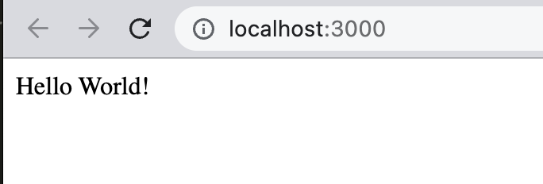

# node-express-hello-world
cpnt201 - Achievements Round 2 NPM (2/2)

author: Myka Peligrino

## Creating a directory and package installation
Using the instructions, I've followed the steps on the [Getting Started Guide] (https://expressjs.com/en/starter/installing.html). 
1. Instead of making a local directory. I've imported the one that I have created in GitHub. I then cloned it to my local workspace.
2. Next, I created a `package.json` using the `$ npm init` command.
3. I just followed the default prompts and filled some areas.
4. I installed Express in my directory using the `$ npm install express` command.
5. Before proceeding to the next step I've also made a `.gitignore` file and entered the `node_modules`
- 

## Hello World example
5. I first created a file name `app.js`.
6. With the code provided fro the guide, I copy and pasted the Hello World code to the app.js
7. I ran the app with the `$ node app.js` command. 
8. I loaded the `http://localhost:3000/` to the browser, and this is the output: 
- 
